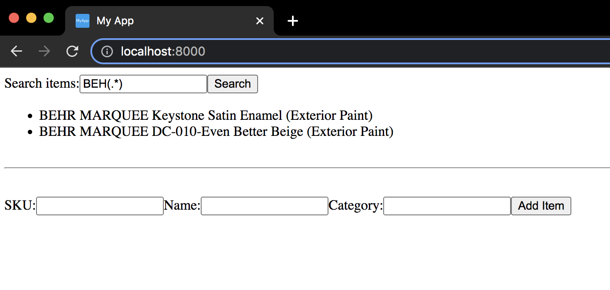

# rdpoc - Background

This is a simple prototype React JS webapp using Atlas MongoDB in Cloud to do following things:

- to provide full-text search on all fields of data
- to find data records based on field specific filters and
- to add data.

The data in this case is a simple product item data as:

_id:  MongoDB generated internal document id
name: (string) Product name like "BEHR MARQUEE Keystone Satin Enamel"
category: (string) Product category like"Exterior Paint"
sku: (string) Product SKU number like "945305"

We have defined Search index on this MongoDB database collection and then we leverage
full-text search capabilities provided by MongoDB to find products. 

# Mongo DB Queries

Some of the queries to filter & search product data is as follows:

// Simple command to find any one product
curl -k --location --request POST 'https://us-west-2.aws.data.mongodb-api.com/app/data-ibscs/endpoint/data/v1/action/findOne' \
--header 'Content-Type: application/json' \
--header 'Access-Control-Request-Headers: *' \
--header 'api-key: XXX' \
--data-raw '{
"collection":"product",
"database":"rd-poc-db",
"dataSource":"RundooCluster0",
"projection": {"_id": 1}
}'

// Find all

curl -k --location --request POST 'https://us-west-2.aws.data.mongodb-api.com/app/data-ibscs/endpoint/data/v1/action/find' \
--header 'Content-Type: application/json' \
--header 'Access-Control-Request-Headers: *' \
--header 'api-key: XXX' \
--data-raw '{
"collection":"product",
"database":"rd-poc-db",
"dataSource":"RundooCluster0",
"filter": { }
}'

// Find specific, filter

curl -k --location --request POST 'https://us-west-2.aws.data.mongodb-api.com/app/data-ibscs/endpoint/data/v1/action/find' \
--header 'Content-Type: application/json' \
--header 'Access-Control-Request-Headers: *' \
--header 'api-key: XXX' \
--data-raw '{
"collection":"product",
"database":"rd-poc-db",
"dataSource":"RundooCluster0",
"filter": { "category": "Exterior Paint" }
}'

// Filter with regex expression

curl -k --location --request POST 'https://us-west-2.aws.data.mongodb-api.com/app/data-ibscs/endpoint/data/v1/action/find' \
--header 'Content-Type: application/json' \
--header 'Access-Control-Request-Headers: *' \
--header 'api-key: XXX' \
--data-raw '{
"collection":"product",
"database":"rd-poc-db",
"dataSource":"RundooCluster0",
"filter": { "category": { "$regex": "Ext" } }
}'

// Search a document with text field search

curl -k --location --request POST 'https://us-west-2.aws.data.mongodb-api.com/app/data-ibscs/endpoint/data/v1/action/aggregate' \
--header 'Content-Type: application/json' \
--header 'Access-Control-Request-Headers: *' \
--header 'api-key: XXX' \
--data-raw '{
"collection":"product",
"database":"rd-poc-db",
"dataSource":"RundooCluster0",
"pipeline": [{"$search": {"index": "product-search","text": {"query": "BEHR","path": "name"} } }]
}'

// Search a document with regular expression

curl -k --location --request POST 'https://us-west-2.aws.data.mongodb-api.com/app/data-ibscs/endpoint/data/v1/action/aggregate' \
--header 'Content-Type: application/json' \
--header 'Access-Control-Request-Headers: *' \
--header 'api-key: XXX' \
--data-raw '{
"collection":"product",
"database":"rd-poc-db",
"dataSource":"RundooCluster0",
"pipeline": [{"$search": {"index": "product-search","regex": {"allowAnalyzedField": true,"query": "(.*)RQUEE","path": "name"}}}]
}'

// Full text search on any field

curl -k --location --request POST 'https://us-west-2.aws.data.mongodb-api.com/app/data-ibscs/endpoint/data/v1/action/aggregate' \
--header 'Content-Type: application/json' \
--header 'Access-Control-Request-Headers: *' \
--header 'api-key: XXX' \
--data-raw '{
"collection":"product",
"database":"rd-poc-db",
"dataSource":"RundooCluster0",
"pipeline": [{"$search": {"index": "product-search","regex": {"allowAnalyzedField": true,"query": "(.*)RQUEE","path": {"wildcard": "*"} } } }]
}'

References:       
https://www.mongodb.com/docs/atlas/atlas-search/regex/
https://www.mongodb.com/docs/atlas/atlas-search/regex/#std-label-regex-ref

# MongoDB Insertion Query

To add product data:

curl -k --location --request POST 'https://us-west-2.aws.data.mongodb-api.com/app/data-ibscs/endpoint/data/v1/action/insertOne' \
--header 'Content-Type: application/json' \
--header 'Access-Control-Request-Headers: *' \
--header 'api-key: XXX' \
--data-raw '{"collection":"product","database":"rd-poc-db","dataSource":"RundooCluster0","document": {"name": "BEHR MARQUEE Keystone Satin Enamel","category": "Exterior Paint","sku": "945305"}
}'

# Architectural/Design choices

For this problem, the core design design is to leverage NoSQL DB like MongoDB and leverage it's full-text search
abilities. The other choice is of API. Since MongoDB provides pure HTTP/REST API it will be used on the Go Server 
backend to fetch data from DB (or to insert).

Twirp RPC can be separately added to the Go Server if there are other Go clients (possibly other micro-services,
the [core usecase of Twirp](https://blog.twitch.tv/en/2018/01/16/twirp-a-sweet-new-rpc-framework-for-go-5f2febbf35f/)) 
wanting to communicate with the Go Server.

At present the API is add & find/search so the Go server can run as a AWS Lambda or in a container, the instances of
which can be increased to support the scale. 

As for the UI, it is a very preliminary React JS application bundled using webpack using commands like:

webpack --stats-error-details=true /Users/umeshpatil/git/rdpoc/src/App.js -o /Users/umeshpatil/git/rdpoc/public/bundle.js

to generate the JavaScript bundle to consume on the browser client side.
